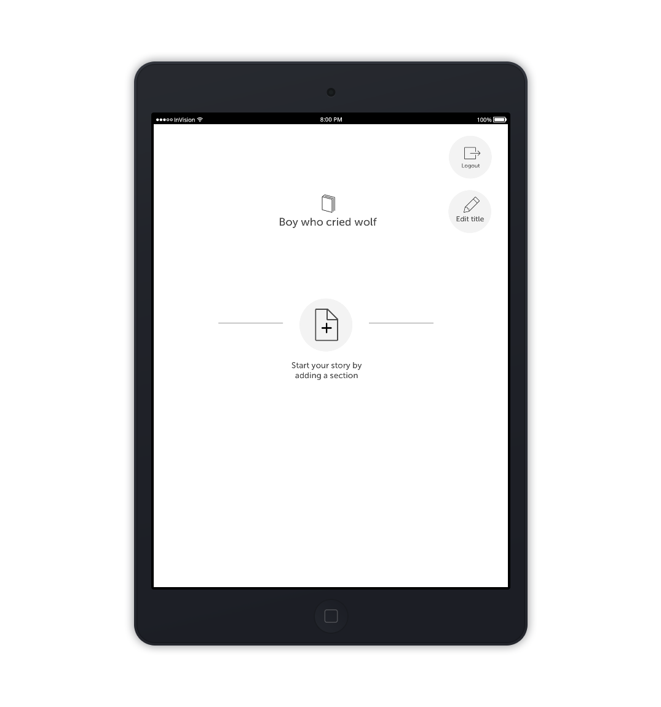

# Little Drops Project Specifications

## Document Version Control

| Date | Description | Version | Organization | Name |
| -------- | -------- | -------- | -------- | -------- |
| 10-01-2020    | Initial Document     | 0.1     | University of Warwick | Terry Lee |
| 25-01-2020    | Added Scope and Work Order     | 0.2     | University of Warwick | Terry Lee |
| 03-02-2020    | Little Drops Introduced     | 0.3     | University College London | Sara Kalantari |
| 23-02-2020    | Added Storyboard and Link to Prototype     | 0.4     | University of Warwick | Terry Lee |
| 03-03-2020    | Added Link to Sample Screen     | 0.4.1    | University of Warwick | Terry Lee |

## About Little Drops

Little Drops app concept has been born out of a series of design workshops with the participation of these industry partners as well as a few parents of young children. The app aims to facilitate the creative process of oral storytelling at home by providing a ‘story template’ and visual ‘prompts’ as supportive structure. Parents, children and their extended family can collect photographs from their everyday lives. Collated in a gallery accessible to the parent and child, these photographs can provide later inspiration by serving as ‘prompts’ to crafting a new story. Prompts are in turn utilized to populate ‘story templates’, which are based on spines of different story genres. Each spine is made out of blocks that support the story sequence allowing the parent and child to keep a cohesive narrative in their story. They also have the facility to record each story as it is told, allowing the parent to build a rich repository of the moments they shared with their children supporting reminiscence.

Little Drops is part of the DROPS project.

The DROPS project investigates the technology, business, economic and legal models of personalization in a decentralized data economy through the creation of ThingBox. As a cloud-enabled space, ThingBox provides for a collaborative personalization space for HAT owners and organizations to come together with their own data to create highly personalized experiences with equitable benefits to both. DROPS project is specifically working with children’s publishers for e-books as the first ‘Thing’ in the ThingBox.

## Stakeholders

|  |  |
| -------- | -------- |
| Principal Investigator     | Mina Vasalou, University College London     |
| Principal Investigator     | Natalia Kucirkova, University College London     |
| Principal Advisor     | Irene Ng, University of Warwick| 
| Principal Designer     | Sara Kalantari, University College London, s.kalantari@ucl.ac.uk     |
| Project Engineer     | Terry Lee, University of Warwick, terry.lee@warwick.ac.uk|

## Proposed Architecture

`Little Drops` consists of
1. an **Android Application** (ref to the system boundary `Little Drops Android Application` in the above diagram)
2. the android application communicates with
    * HAT microservers
        * to store reading activity
        * to store stories created by users
    * Dataswift HAT BaaS server
        * to provision HATs
        * to set write permissions on the HAT
    * Thinkspace Server
        * this server is a custom server designed as part of this DROPS project
        * responsible for aggregating reading activity data shared by HAT owners

## Scope of Work

The selected Developer is required to fulfill the following
1. create an Android Application that meets all the User stories below. (Refer to `User stories`)
2. the said Android application must be able to save stories created by the user to his specific HAT microserver. The developer is expected to work with the Stakeholders to design the Story data model used.
3. the said Android application must be able to save reading activity to the HAT microserver. The developer is expected to work with the Stakeholders to design the Reading Activity data model used
4. the said Android application should be able to communicate with the Dataswift BaaS to provision HATs if needed.

All functions related to the **Thinkspace Server** is **OUT OF SCOPE** of this iteration. In short, only the Android application needs to be developed. (Refer to `Technical Requirements` in the following sections for more information.)

## User stories
- [ ] User should be able to sign on to the Little Drops application with an existing HAT
    - There are 2 ways of signing in with the HAT - using HAT URL or email address.
    - [ ] Only email sign in needs to be implemented.
- [ ] If the User does not have an existing HAT, then a HAT will be created.
- [ ] On the *first* sign on, the application should be able to write some basic profile information to the HAT. The informtion includes
    - [ ] Full Name
    - [ ] Role (Father, Mother, Guardian etc)
    - [ ] Profile Picture (You will need to make use of the File api of the HAT. The SDKs currently do not support this feature.)
- [ ] The application should cache the Users signed on and present it as a quick list (Screen 5)
- [ ] User should be able to see a landing page showing (Screen 9)
    - [ ] a carousel of Story Templates
    - [ ] a carousel of Stories created. (This would initially be blank)
- [ ] User should be able to create a story (Screen 10)
    - [ ] The list of options and scenarios available is fixed and can initially be hardcoded into the source codes.
- [ ] User should be able to edit a story
- [ ] User should be able to delete a story

## Licensing Requirements

The source codes to this project will be made available to the public under the Mozilla Public Licence 2.0 (MPL).

Ensure that all codes delivered to this project are MPL compliant and compatible, including external libraries used.

## Technical Requirements

### The Backend
* The developer should avoid creating a custom backend as much as possible. Instead, available BaaS and SaaS should be explored and used.
* Every user of the Little Drops application must have a HAT PDA. When signing into the Little Drops application, the user must have already owned a HAT, or one will be created for him. For the latter, refer to https://docs.dataswift.io/solutions/backend-as-a-service
* We will be using the Dataswift BaaS to provision needed HATs. All application data should be stored on the user's HAT. Hence, the developer should be familiar with building on the HAT.

### The Application
* Little Drops is to be built as an Android application.
* The application should be optimized for a Tablet profile in both Portrait and Landscape orientation.
* The minimum Android version is Nougat 7.x
* The test reference hardware is a Lenovo Tab 4 8
    * https://www.lenovo.com/gb/en/tablets/android-tablets/tab-4-series/Lenovo-TB-8504/p/ZZITZTATB08
* The developer will be provided with 1 test reference tablet

### Language and Libraries
* The Little Drops application should be developed in either
    * React Native
        * Native modules are permitted if required.
        * Hermes is optional
        * A Javascript SDK is available to help read+write data to the HAT => https://www.npmjs.com/package/@dataswift/hat-js
        * A ReactJS starter kit which makes use of the above SDK is available at => https://github.com/Hub-of-all-Things/hat-starter-app-js
            * Although this starter kit is not a React Native kit, it may still be helpful.
            * it contains examples of Signing up a new user; Logging in with existing HAT; reading and writing of HAT data 
    * Android Native
        * the prefered language is Kotlin 1.3 followed by Java 11
        * Gradle 5.x should be the default build tool
        * A Java SDK is also available for Android => https://github.com/Hub-of-all-Things/HAT-API-Android
        * A starter kit for building HAT enabled Android applications can be found here => https://github.com/Hub-of-all-Things/hat-starter-app-android

### Other requirements
* Sensitive data such as API keys should not be hardcoded in the source codes, nor configuration files. Environment variables or environment (.env) files should be used.
* If environment files are used, they should not be committed to the code repository.

## Project Delivery
* The project is expected to run for about 4 weeks.
* The developer is expected to deliver 1 apk for testing every week on an agreed day.
* Codes should be diligently committed to a provided git repository.
* The delivered project should contain a README file describing how to build the apk, publish to the Google Play store. Dependencies should also be listed

## Reference wireframe and prototype
### Prototype
The interactive prototype of the Little Drops software is located at https://invis.io/GVW23WNCNEH

### Reference Wireframes
Reference wireframes are provided in *Appendix A: Storyboard*. The screens used are mostly obtained from the interactive prototype

### UI Assets
Graphical assets will be given to the Android Developer to skin the application. These assets includes non-exhaustively
* Color codes and schemes
* Sample UI pages using the above color codes and schemes
* Fonts and components look and feel

This is how the application looks like => https://invis.io/XHW88N134YP

## Appendix A: Storyboard

This Appendix contains notes and storylines about the Little Drops application. The storyboard is a direct image of the interactive prototype. It's recommended the developer follow the notes here together while navigating the prototype.

### Board 1

* This is the landing screen that the user see on starting or resuming the application
* In a fresh installation, there would not be any existing profiles. i.e. the 3 profiles with the circular pictures would not be present
* Clicking on `New Profile` would bring the user to `Board 2` 
* Clicking on an Existing Profile would bring the user to `Board 3` 

### Board 2

* In this screen, the user is asked for the email that he has used to get a HAT with
* The user with an existing HAT clicks on the `Next` button after keying in his email address. This will bring him to `Board 3`

### Board 3

* ATTENTION: There is no need to code this Board
* The password screen is part of the HAT microserver
* The standard HAT login user journey will need to be implement. The user journey and implementation are described here => https://docs.dataswift.io/guides/hat-login
* On a successful login, the user will be directed to `Board 5`

### Board 4

* This screen is the start of getting a HAT
* It starts off the sequence described in https://docs.dataswift.io/solutions/backend-as-a-service
* Webview or similar technologies would be required
* On a successful signup, the user will be directed to `Board 5`
* PS. The developer will need to sign up on the HAT Developers' Portal https://developers.dataswift.io/ to set up Little Drops as an HAT application

### Board 5

* A little personal information about the current User.
* Store this information into the HAT
* The dropdown will only have 3 values [Father, Mother, Guardian]
* The screen goes to `Board 6` on clicking `Save/Continue`

### Board 6

* This is where the stories are listed
* This page can also be accessed by clicking on the `My Stories` icon in the menu bar.
* New stories are created in `Board 10` which can be accessed by clicking `New Story`
* Initially this page will be empty
* New stories are stored on the HAT and retrieved for this page.
* 3 icons will appear on selecting a story
    * `Read` icon will go into read mode `Board 7`
    * `Edit` icon will go into edit mode `Board 8`
    * `Delete` icon will go into delete mode `Board 9`

### Board 7

* Where the story is read
* Store in the HAT the timestamp where this screen is entered and left

### Board 8

* Where the story is edited.
* This is functionally similar to `New Story`
* Clicking `Cancel` will return to the `My Stories` page

### Board 9

* A `confirmation dialog` will appear on clicking the Delete button in `Board 6`

### Board 10

* This is where you pick a theme to create a story from

### Board 11

* This is the start of a New Story

### Board 12

* After adding a new section by clicking on the +

### Board 13

* Selecting the section
* The contents of the Dropdown is dependent on the theme selected when creating the story

### Board 14

* On selecting a section from the drop down, a Text Area appears

### Board 15

* The Text Area is automatically populated with starting phrases, depending on which item of the Dropdown in `Board 13` is selected.
* The user is then expected to continue the paragraph/section

### Board 16

* More sections can be added

### Board 17

* Changing the Title of the Story